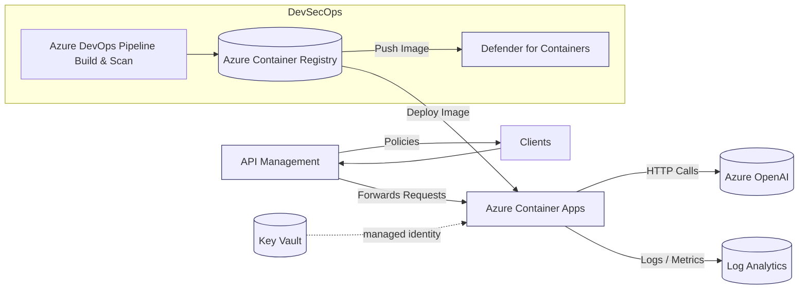

# Claim Status API

Containerized .NET 8 minimal API providing:
- `GET /claims/{id}` � Returns static claim data from `mocks/claims.json`.
- `POST /claims/{id}/summarize` � Loads claim notes from `mocks/notes.json`, calls Azure OpenAI (Chat Completions REST) to produce: `summary`, `customerSummary`, `adjusterSummary`, `nextStep`.

Fronted by Azure API Management (APIM), deployed to Azure Container Apps (ACA), automated via Azure DevOps pipeline.

---
## Quick Start (Local)
1. Prereqs: .NET 8 SDK, Docker (optional), Azure OpenAI resource (or skip summarization test).
2. Restore & run:
   ```bash
   dotnet build
   dotnet run --project src/ClaimStatusApi
   ```
3. Swagger UI (dev): http://localhost:5000/swagger (actual port from console).
4. Sample calls:
   ```bash
   curl http://localhost:5000/claims/CLM-1001
   curl -X POST http://localhost:5000/claims/CLM-1001/summarize
   ```
5. To enable real summarization set env vars (or use secrets in container):
   - `OpenAI__Endpoint=https://<your-openai>.openai.azure.com`
   - `OpenAI__Deployment=<model-deployment-name>`

If unreachable or unauthorized, API returns fallback text.

---
## Run in Docker
```bash
docker build -t claimstatusapi:dev .
docker run -p 8080:8080 -e OpenAI__Endpoint=... -e OpenAI__Deployment=... claimstatusapi:dev
curl http://localhost:8080/claims/CLM-1002
```

---
## Repository Structure
```
?? src/ClaimStatusApi/           # .NET 8 minimal API source
?  ?? Program.cs                 # Endpoint mappings
?  ?? Services/                  # Repository + Summarization service (REST to Azure OpenAI)
?  ?? Models/                    # DTO / record types
?  ?? appsettings.json           # Default config (placeholder OpenAI values)
?  ?? ClaimStatusApi.csproj
?? mocks/
?  ?? claims.json                # 8 mock claim records
?  ?? notes.json                 # Notes per claim used for summarization
?? apim/
?  ?? api-policy.xml             # Global API-level policies
?  ?? get-claim-operation-policy.xml
?  ?? post-summarize-operation-policy.xml
?  ?? README.md                  # How to apply policies
?? iac/
?  ?? bicep/main.bicep           # Bicep deployment
?  ?? terraform/main.tf          # Terraform alternative
?  ?? README.md
?? pipelines/azure-pipelines.yml # Azure DevOps CI/CD (build, push, vuln gate, deploy)
?? Dockerfile                    # Multi-stage container image
?? README.md                     # This file
```

---
## Architecture Overview



Legend:
- Azure DevOps Pipeline: builds & pushes image, triggers Defender scan.
- Defender for Containers: automatically scans images on push (exposes vulnerability findings to pipeline gate).
- APIM: front door with policies (rate limit, transformations) routing to Container App.
- ACA: hosts the minimal API; uses managed identity for OpenAI & (optionally) Key Vault.
- Key Vault: (optional) source of secrets if enabled.
- Azure OpenAI: provides summarization via Chat Completions.
- Log Analytics: central log store (Serilog console collected if configured).

Data Flow (simplified): Client → APIM → ACA → Azure OpenAI → ACA → APIM → Client.

Security Highlights:
- Managed Identity removes need for storing OpenAI keys in code.
- APIM policies enforce rate limits protecting OpenAI cost exposure.
- Image scanning + vulnerability gate stops risky images before deploy.


---
## Azure DevOps Pipeline
File: `pipelines/azure-pipelines.yml`
Stages:
1. Build (.NET build + publish artifact)
2. Container (docker build/push, ACR vulnerability gate using Defender scan results)
3. Deploy (ACA create/update + APIM placeholder)

Required Variables / Pipeline Variables:
```
ACR_NAME, ACR_LOGIN_SERVER, IMAGE_REPO, RESOURCE_GROUP, LOCATION,
ACA_ENV, ACA_NAME, OPENAI_ENDPOINT, OPENAI_DEPLOYMENT, APIM_NAME,
VULN_FAIL_SEVERITY (High|Critical)
```
Service Connection: `AZURE_SUB` (ARM connection).

Gate Logic: Fails if Defender scan reports >= configured severity (High also fails on Critical).

Additions you can extend:
- SBOM: Add `dotnet build /p:GeneratePackageGraph=true` or CycloneDX task.
- SAST/IaC: Integrate Defender for DevOps or CodeQL step.
- Key Vault: Replace inline env with `az containerapp secret set --secrets keyvault-ref=...` (or managed identity + Key Vault references).

---
## CI/CD Detailed Flow (Build → Scan → Gate → Deploy)

### Diagram
```mermaid
flowchart LR
   A[Checkout & Restore] --> B[.NET Build]
   B --> C[Docker Build Image]
   C --> D[Push to ACR]
   D --> E{Image Scan}
   E -->|Clean| F[Deploy ACA]
   E -->|High/Critical| G[Fail Pipeline]
   F --> H[Configure APIM Policies]
   subgraph Optional_Security_Augmentation[Optional Security Augmentation]
      X[Defender for DevOps Task (IaC / Secrets Scan)] --> B
   end
   style G fill:#ffdddd,stroke:#ff5555
   style F fill:#ddffdd,stroke:#22aa22
```

The optional Defender for DevOps task runs early so failures surface before container build.

### 1. Build Image
The pipeline executes a standard multi-stage Docker build (see `Dockerfile`) after restoring and compiling the .NET solution:
```
docker build -t $(ACR_LOGIN_SERVER)/$(IMAGE_REPO):$(IMAGE_TAG) .
```
Best practices:
- Keep base image updated (patches reduce vulnerabilities).
- Use multi-stage to avoid SDK layers in runtime image.
- Consider adding labels (org.opencontainers.image.*) for provenance.

### 2. Security / Scan Options
You can use either (or both) of these paths:

Path A (Container Image Vulnerabilities via Defender for Containers):
1. Push image to Azure Container Registry (ACR).
2. Defender for Containers automatically scans the image (no extra command needed) once the plan `ContainerRegistry` is enabled.
3. Pipeline polls `az acr manifest show-vulnerabilities` for `scanStatus` and summary severities.

Path B (IaC & Code Posture via Defender for DevOps):
1. Onboard Azure DevOps org in Defender for Cloud.
2. Add `SecurityDevOps@1` task with `categories: 'IaC,Secrets'` (optionally `Code,Containers`).
3. This runs tools like Template Analyzer (Bicep), tfsec / Terrascan (Terraform), secret scanning, and aggregates findings in Defender for Cloud.

Optional Enhancements:
- Add SBOM generation (Syft/CycloneDX) and sign image (Cosign) prior to push.
- Add Trivy or Grype local scan for immediate feedback before push (still keep Defender as authoritative source for gate).

### 3. Gate Policy (Fail Build on High/Critical)
Current logic (simplified):
```
if VULN_FAIL_SEVERITY == "High": fail if High > 0 OR Critical > 0
if VULN_FAIL_SEVERITY == "Critical": fail if Critical > 0
```
Recommendations:
- Start with threshold=Critical for a backlog burn‑down phase, then tighten to High.
- Capture metrics trend by publishing `vulns.json` as artifact (already in pipeline) for historical comparison.
- Optionally enforce governance using Azure DevOps environment checks or a separate quality gate stage.

Suggested extension: produce SARIF and upload to a security dashboard (Defender for DevOps or GitHub Advanced Security if mirrored) for centralized triage.

### 4. Deploy (ACA + APIM)
Deployment uses Azure CLI to:
1. Create/update Azure Container App with system-assigned managed identity.
2. Assign `AcrPull` role to that identity on ACR.
3. Set OpenAI secrets and environment variables.
4. (Optional / placeholder) Apply APIM API + operation policies from `apim/` directory.

Alternative Deployment Methods:
- Bicep (`iac/bicep/main.bicep`) for declarative infra; pass `containerImage` parameter.
- Terraform (`iac/terraform/main.tf`) for multi-cloud or advanced state management.

Rollback / Safe Deploy Tips:
- Use a revision label strategy in ACA (retain previous revision until new one healthy).
- For APIM, stage new APIs with a `-beta` suffix before swapping path.
- Add health probe step after deploy: `curl https://<fqdn>/healthz`.

### 5. Putting It All Together
Sequence:
```
Checkout → dotnet restore/build → docker build → docker push → (Defender auto-scan) → poll vulnerabilities → gate → deploy container app → (optionally) configure APIM
```

If adding Defender for DevOps task, insert it right after checkout (before build) so it can scan IaC early:
```
- task: SecurityDevOps@1
   displayName: 'Microsoft Security DevOps (IaC & Secrets)'
   inputs:
      categories: 'IaC,Secrets'
      break: false  # set true once comfortable failing on findings
```

---
## Quick Reference Variables
| Variable | Purpose |
|----------|---------|
| `ACR_NAME` | Registry name (without .azurecr.io) |
| `ACR_LOGIN_SERVER` | FQDN of registry (e.g. myregistry.azurecr.io) |
| `IMAGE_REPO` | Repository name inside ACR (e.g. claimstatusapi) |
| `IMAGE_TAG` | Tag (Build.BuildId or semantic) |
| `VULN_FAIL_SEVERITY` | Gate threshold (High or Critical) |
| `ACA_ENV` | Azure Container Apps environment name |
| `ACA_NAME` | Container App name |
| `RESOURCE_GROUP` | Resource group for deployment |
| `OPENAI_ENDPOINT` | Azure OpenAI endpoint URL |
| `OPENAI_DEPLOYMENT` | Deployed model name |
| `APIM_NAME` | API Management instance (optional) |

---

---
## Infrastructure as Code
Choose Bicep or Terraform (they provision: Log Analytics, ACA Env, Container App, APIM, optional ACR).

Bicep deploy:
```bash
az deployment group create \
  -g <rg> \
  -f iac/bicep/main.bicep \
  -p containerImage="<acr>.azurecr.io/claimstatusapi:<tag>" \
     openAiEndpoint="https://<openai>.openai.azure.com" \
     openAiDeployment="gpt-4o-mini"
```

Terraform deploy:
```bash
cd iac/terraform
terraform init
terraform apply -var resource_group_name=<rg> \
  -var container_image=<acr>.azurecr.io/claimstatusapi:<tag> \
  -var openai_endpoint=https://<openai>.openai.azure.com \
  -var openai_deployment=gpt-4o-mini
```

Post-deploy:
1. Import OpenAPI into APIM from running Container App Swagger.
2. Apply policies in `apim/` (see apim/README.md commands).
3. Grant Container App system-assigned managed identity role `Cognitive Services User` on the Azure OpenAI resource (if using AAD auth flow; current implementation uses managed identity to fetch token).

---
## APIM Policies Overview
- Global `api-policy.xml`: rate limit (100 calls/min), backend routing, unified error body.
- GET policy: additional rate limit (30/min) + 30s cache.
- POST summarize policy: tighter rate limit (10/min) + payload size validation.
Adjust counters or add JWT validation (`validate-jwt`) for production.

---
## Summarization Flow
1. Repository loads `claims.json` / `notes.json` (cached in memory).
2. Summarization service builds structured system & user prompts.
3. Calls Azure OpenAI Chat Completions REST endpoint with bearer token obtained via `DefaultAzureCredential` (Managed Identity when deployed).
4. Attempts to parse JSON from model output. On failure returns raw content in all fields.
5. Fallback: On error returns static "Summarization unavailable" response.

System Prompt Used:
```
You are an insurance claims assistant. Create: (1) a concise general summary (2) a simple customer-facing summary (3) a more detailed adjuster summary with any missing info callouts (4) a single recommended next step phrase. Return JSON with keys summary, customerSummary, adjusterSummary, nextStep.
```
User Prompt Template:
```
Claim: {Id} Type: {Type} Status: {Status} LossDate: {LossDate} Notes:\n- author: text ...
```
Modify prompts by updating `OpenAiSummarizationService`.

---
## API Reference Generation
The project uses .NET minimal APIs with Swashbuckle to emit OpenAPI (Swagger) at runtime in Development. For non-dev/hosted environments you can force-enable swagger via an environment variable (see `Program.cs` customization) or generate a static OpenAPI file during CI for documentation & APIM import.

### Generate OpenAPI JSON Locally
```bash
dotnet build
dotnet run --project src/ClaimStatusApi --configuration Release &
sleep 5
curl http://localhost:5000/swagger/v1/swagger.json -o openapi.json
```

### CI Snippet (Optional)
Add a pipeline step (after build) to capture the spec and publish as an artifact:
```yaml
- script: |
      dotnet run --project src/ClaimStatusApi --urls http://0.0.0.0:5000 &
      PID=$!; sleep 8
      curl http://localhost:5000/swagger/v1/swagger.json -o openapi.json
      kill $PID || true
   displayName: 'Generate OpenAPI spec'
- publish: openapi.json
   artifact: openapiSpec
```
Then APIM import:
```bash
az apim api import --resource-group <rg> --service-name <apim> \
   --path claims --api-id claims-api --specification-format OpenApi \
   --specification-file openapi.json --protocols https --version 1.0.0
```

### Future Enhancements
- Add a GitHub Action / ADO check that diff-detects breaking changes (e.g., using OpenAPI diff tools).
- Convert to Redoc / Slate static documentation site from the generated OpenAPI.

---
## Architectural Decision Records (ADR)
ADR files live in `adr/`. Adopt the lightweight MADR style: one markdown file per decision.

Current decisions:
- [ADR 0001: Adopt APIM as Gateway](adr/0001-adopt-apim-gateway.md)

Future candidate ADRs:
- Switch from CLI APIM policy application to Bicep/ARM or Terraform.
- Introduce JWT authentication & identity provider selection.
- Observability stack evolution (App Insights vs custom logging only).
- Vulnerability gating threshold strategy (Critical → High timeline).

---
## Observability
Log Analytics collects console logs. Sample KQL (create an `observability/` folder if needed):
```
// High latency ( > 1000 ms ) requests (if custom metrics added later)
AppTraces | where Message contains "Request completed" and toint(Extract("duration=(\\d+)", 1, Message)) > 1000

// Error logs
AppTraces | where SeverityLevel >= 3
```
APIM Analytics: use Azure Portal (Latency, Failure %, Usage). Export or pin dashboards; apply rate-limits to protect OpenAI cost.

Add structured logging: extend Serilog sinks (eg. Seq, Application Insights) if required.

---
## Security Notes
- Defender for Cloud auto image scan after push to ACR triggers vulnerability gate.
- Rate limiting + subscription key in APIM to protect backend & cost.
- Use Managed Identity for Azure OpenAI (avoid API keys).
- Optionally add WAF / Private endpoints + Key Vault for secrets.

---
## Testing
Currently no unit tests. Suggested quick additions:
- Repository tests loading JSON.
- Summarization service test with mocked HTTP handler (returning fixed JSON).
- Contract tests for endpoints using `WebApplicationFactory`.

Example `dotnet new xunit -o tests` then reference project & add to solution.

---
## Common Issues
| Problem | Cause | Fix |
|---------|-------|-----|
| 500 on summarize | OpenAI auth/endpoint misconfigured | Verify env vars & managed identity role |
| Empty summaries | Model returned non-JSON content | Adjust prompt or add output parser | 
| Vulnerability gate fails | High/Critical findings | Patch / rebuild, raise threshold only as last resort |

---
## Extensibility Ideas
- Add pagination & list endpoint (`GET /claims`).
- Add authentication (JWT + `validate-jwt` APIM policy).
- Add caching layer (Redis) or ETag for claim retrieval.
- Add cost logging per summarization request.
- Introduce background enrichment worker.

---
## License
(Add appropriate license file if distributing.)

---
## Generated With GenAI Assistance
Prompts leveraged to create: API endpoints, OpenAI prompt text, pipeline YAML, APIM policies, IaC templates, README skeleton, mock data expansions.

